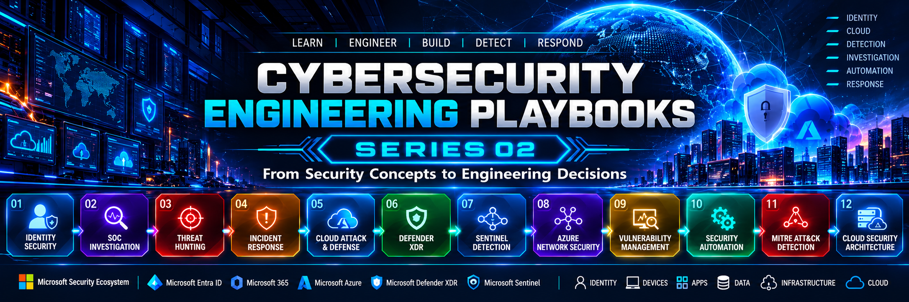
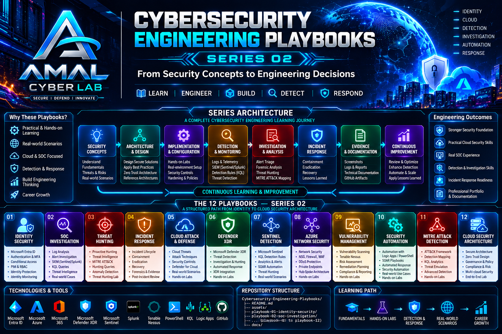

<div align="center">



# 🛡️ Cybersecurity Engineering Playbooks

### Series 02 — From Security Concepts to Engineering Decisions

**Learn → Engineer → Build → Detect → Respond**

</div>

---

## 🎯 About This Series

**Cybersecurity Engineering Playbooks** is the second engineering-focused series from **Amal Cyber Lab**.

The goal is to move beyond static security references and document **how a security engineer approaches real security problems** — from understanding the threat and designing controls to implementation, detection, investigation, response, evidence, and continuous improvement.

> **How do we turn security knowledge into repeatable engineering decisions?**

### Core Engineering Lifecycle

```text
Security Concept
      ↓
Architecture & Design
      ↓
Implementation & Configuration
      ↓
Detection & Monitoring
      ↓
Investigation & Analysis
      ↓
Incident Response
      ↓
Evidence & Documentation
      ↓
Continuous Improvement
```

---

## 🏗️ Series Architecture



| Stage | Engineering Focus |
|---|---|
| 🧠 Security Concepts | Fundamentals, threats, risks, scenarios |
| 🏗️ Architecture & Design | Secure solution and control design |
| ⚙️ Implementation | Configuration and validation |
| 🔎 Detection & Monitoring | Telemetry and detection capabilities |
| 🧪 Investigation & Analysis | Triage, investigation, threat hunting |
| 🚨 Incident Response | Containment, eradication, recovery |
| 📋 Evidence & Documentation | Logs, screenshots, reports, GitHub evidence |
| 🔄 Continuous Improvement | Review, optimize, automate, improve |

---

# 📚 The 12 Cybersecurity Engineering Playbooks

## 01 — Identity Security
**Status:** 🔄 In Progress

Microsoft Entra ID • MFA • Conditional Access • Identity Protection • RBAC • PIM • Least Privilege • Identity Monitoring

**Engineering scenario:** How do we prevent compromised credentials from becoming a path into privileged resources?

## 02 — SOC Investigation
**Status:** ⏳ Planned

Alert triage • Log analysis • Microsoft Sentinel • Splunk • KQL • Threat intelligence • Investigation workflows

## 03 — Threat Hunting
**Status:** ⏳ Planned

Threat hypotheses • MITRE ATT&CK • KQL hunting • Anomaly detection • Threat intelligence • Hunting workflows

## 04 — Incident Response
**Status:** ⏳ Planned

Incident lifecycle • Detection • Containment • Eradication • Recovery • Forensics & evidence • Lessons learned

## 05 — Cloud Attack & Defense
**Status:** ⏳ Planned

Cloud threats • Attack techniques • Defensive controls • Defender for Cloud • Attack-path thinking • Cloud labs

## 06 — Microsoft Defender XDR
**Status:** ⏳ Planned

Defender XDR • Identity • Endpoint • Email • Cloud signals • Investigation • Threat hunting • Automated response

## 07 — Microsoft Sentinel Detection Engineering
**Status:** ⏳ Planned

Sentinel • KQL • Analytics rules • Incidents • SOAR • Threat hunting • Detection engineering

## 08 — Azure Network Security
**Status:** ⏳ Planned

NSG • Azure Firewall • WAF • DDoS Protection • Private Endpoints • Hub-Spoke • Network segmentation

## 09 — Vulnerability Management
**Status:** ⏳ Planned

Tenable Nessus • Vulnerability scanning • Risk assessment • Prioritization • Remediation • Validation

## 10 — Security Automation
**Status:** ⏳ Planned

PowerShell • Logic Apps • Sentinel automation • SOAR • Automated enrichment • Automated response

## 11 — MITRE ATT&CK Detection Engineering
**Status:** ⏳ Planned

ATT&CK • Technique mapping • KQL analytics • Threat emulation • Advanced detection • Investigation

## 12 — Cloud Security Architecture
**Status:** ⏳ Planned

Secure architecture • Zero Trust • Governance • Risk • Multi-cloud concepts • Reference architecture

---

# 🧠 Engineering Methodology

Every playbook follows:

```text
UNDERSTAND
    ↓
MODEL THE THREAT
    ↓
DESIGN THE ARCHITECTURE
    ↓
IMPLEMENT THE CONTROLS
    ↓
VALIDATE THE CONTROLS
    ↓
DETECT SECURITY EVENTS
    ↓
INVESTIGATE ACTIVITY
    ↓
RESPOND TO THE THREAT
    ↓
COLLECT EVIDENCE
    ↓
DOCUMENT FINDINGS
    ↓
IMPROVE THE DESIGN
```

The objective is not only to learn **what a security control does**, but also why it is required, where it belongs, how it is implemented, what telemetry it produces, how abuse is detected, how incidents are investigated, and how the design can be improved.

---

# 🛠️ Technologies & Tools

### Microsoft Security
Microsoft Entra ID • Microsoft Azure • Microsoft 365 • Microsoft Defender XDR • Defender for Cloud • Microsoft Sentinel • Azure RBAC • PIM • Conditional Access • Identity Protection

### Security Operations
SIEM • SOAR • KQL • Splunk • Threat Intelligence • MITRE ATT&CK • Incident Response • Threat Hunting • Detection Engineering

### Engineering & Automation
PowerShell • Azure Logic Apps • Security analytics • Automation workflows • GitHub

### Vulnerability Management
Tenable Nessus • Vulnerability Assessment • Risk Analysis • Remediation Validation

---

# 📁 Repository Structure

```text
Cybersecurity-Engineering-Playbooks/
│
├── README.md
├── assets/
│   ├── series-02-banner.png
│   └── series-02-architecture.png
│
├── playbook-01-identity-security/
│   ├── README.md
│   ├── architecture/
│   ├── investigation/
│   ├── detection/
│   ├── response/
│   └── evidence/
│
├── playbook-02-soc-investigation/
├── playbook-03-threat-hunting/
├── playbook-04-incident-response/
├── playbook-05-cloud-attack-defense/
├── playbook-06-defender-xdr/
├── playbook-07-sentinel-detection/
├── playbook-08-azure-network-security/
├── playbook-09-vulnerability-management/
├── playbook-10-security-automation/
├── playbook-11-mitre-detection/
├── playbook-12-cloud-security-architecture/
└── docs/
    └── methodology.md
```

---

# 📈 Learning Path

```text
SECURITY FUNDAMENTALS
        ↓
HANDS-ON ENGINEERING
        ↓
DETECTION & MONITORING
        ↓
INVESTIGATION
        ↓
INCIDENT RESPONSE
        ↓
REAL-WORLD SCENARIOS
        ↓
SECURITY ARCHITECTURE
        ↓
CONTINUOUS IMPROVEMENT
```

---

# 📊 Series Progress

| # | Playbook | Status |
|---:|---|---|
| 01 | Identity Security | 🔄 In Progress |
| 02 | SOC Investigation | ⏳ Planned |
| 03 | Threat Hunting | ⏳ Planned |
| 04 | Incident Response | ⏳ Planned |
| 05 | Cloud Attack & Defense | ⏳ Planned |
| 06 | Microsoft Defender XDR | ⏳ Planned |
| 07 | Sentinel Detection Engineering | ⏳ Planned |
| 08 | Azure Network Security | ⏳ Planned |
| 09 | Vulnerability Management | ⏳ Planned |
| 10 | Security Automation | ⏳ Planned |
| 11 | MITRE ATT&CK Detection Engineering | ⏳ Planned |
| 12 | Cloud Security Architecture | ⏳ Planned |

> **This master README will be continuously updated as each playbook moves from planned → in progress → complete.**

---

# 🔗 Series 01 Connection

**Series 01 — Cybersecurity Cheat Sheets:** *Understand the Security Ecosystem*

**Series 02 — Cybersecurity Engineering Playbooks:** *Engineer the Security Ecosystem*

```text
UNDERSTAND → ENGINEER → BUILD → DETECT → INVESTIGATE → RESPOND → IMPROVE
```

---

# 👨‍💻 Amal Cyber Lab

A personal cybersecurity engineering initiative focused on cloud security, Microsoft security, identity security, SIEM/SOC operations, threat detection, incident response, automation, and security architecture.

- 🌐 Portfolio: https://amalcyberlab.vercel.app
- 💻 GitHub: https://github.com/AmalUBasnayake
- 💼 LinkedIn: https://linkedin.com/in/amal-udayanga-basnayake
- ✍️ Medium: https://medium.com/@amalubasnayake

---

## ⚠️ Disclaimer

This repository is intended for educational, research, lab, and professional development purposes. Perform security testing only on systems and environments where you have explicit authorization.

<div align="center">

### 🛡️ Learn. Engineer. Build. Detect. Respond.

**AMAL CYBER LAB — Cybersecurity Engineering Playbooks, Series 02**

</div>
