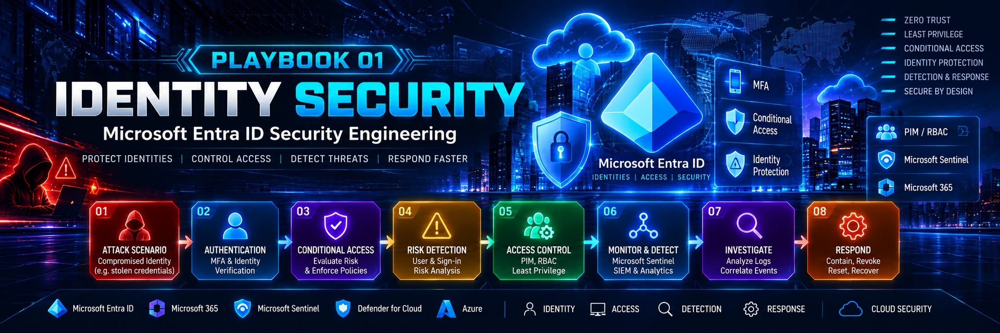
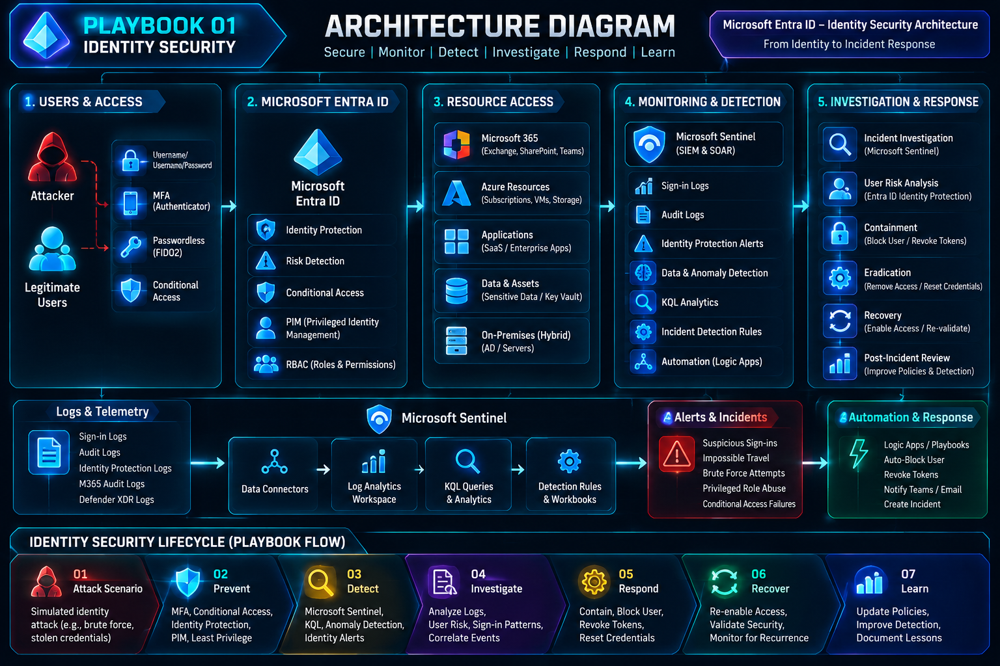

<div align="center">



<br>


</div>

---

# 🛡️ Playbook 01 - Identity Security

## Microsoft Entra ID Security Engineering

> **Protect identities. Control access. Detect threats. Respond faster.**

This playbook documents an engineering approach to protecting cloud identities using Microsoft Entra ID and related Microsoft security capabilities.

## 🎯 Engineering Question

> **If an attacker obtains a user's credentials, how do we prevent that identity from becoming a path into the environment?**

```text
Compromised Identity
        ↓
Authentication
        ↓
Conditional Access
        ↓
Risk Evaluation
        ↓
Least Privilege
        ↓
RBAC / PIM
        ↓
Resource Access
        ↓
Monitoring & Telemetry
        ↓
Detection
        ↓
Investigation
        ↓
Response & Recovery
```

## 🏗️ Identity Security Architecture



## 🚨 Attack Scenario - Compromised Identity

A controlled scenario where an attacker obtains valid credentials and attempts to access the environment.

```text
Attacker
   ↓
Stolen Credentials
   ↓
Microsoft Entra ID
   ↓
MFA + Conditional Access
   ↓
Risk Evaluation
   ↓
Access Decision
   ↓
Monitoring
   ↓
Detection
   ↓
Investigation
   ↓
Response
```

### Security Engineering Objective

Valid credentials alone should not automatically represent sufficient trust. Access decisions should consider identity, authentication requirements, policy, risk, privilege, and resource sensitivity.

## 🔐 Security Controls

### 01 - Authentication
- MFA
- Strong authentication methods
- Passwordless authentication where appropriate
- Authentication monitoring

### 02 - Conditional Access
- Require MFA
- Apply stronger controls to privileged access
- Block legacy authentication
- Apply defined access conditions
- Apply risk-based controls where supported by the environment

### 03 - Identity Risk
- Suspicious sign-in activity
- Unusual authentication patterns
- User risk
- Sign-in risk
- Identity Protection alerts

### 04 - Least Privilege

```text
Minimum Access
      ↓
Required Permissions
      ↓
Limited Scope
      ↓
Limited Duration
      ↓
Continuous Review
```

### 05 - RBAC & PIM

RBAC defines permissions through roles. PIM can support controlled privileged access through mechanisms such as eligible access and time-bound activation, depending on licensing and configuration.

> **Engineering objective: Reduce unnecessary standing privilege and control privileged access.**

## 🔎 Monitoring & Detection

```text
Microsoft Entra Sign-in Logs
        +
Microsoft Entra Audit Logs
        +
Identity Protection Signals
        +
Microsoft 365 Audit Data
        +
Microsoft Defender Signals
        ↓
Security Monitoring
        ↓
Detection & Investigation
```

Potential investigation areas:

- Suspicious sign-ins
- Repeated authentication failures
- Conditional Access failures
- Privileged role activity
- Unexpected access patterns
- Abnormal user behavior

## 🧪 Investigation Workflow

```text
Suspicious Activity
        ↓
Identify User
        ↓
Review Sign-in Activity
        ↓
Review Authentication
        ↓
Review Conditional Access
        ↓
Assess Risk
        ↓
Review Privileged Activity
        ↓
Correlate Events
        ↓
Determine Scope
        ↓
Contain / Escalate
```

### Investigation Questions

1. Who is the affected identity?
2. What resource was being accessed?
3. Where did the sign-in originate?
4. What authentication method was used?
5. Did Conditional Access apply?
6. Was MFA satisfied?
7. Was the activity considered risky?
8. Did the identity have privileged access?
9. What related activity occurred?
10. What containment action is required?

## 🚨 Response Workflow

```text
Detect
  ↓
Validate
  ↓
Contain
  ↓
Investigate
  ↓
Eradicate
  ↓
Recover
  ↓
Re-validate
  ↓
Improve
```

Potential response actions, depending on the incident and authorization:

- Restrict the affected user
- Revoke sessions/tokens
- Reset credentials
- Remove unnecessary access
- Review privileged roles
- Investigate related identities/resources
- Re-enable access after validation
- Document lessons learned

## 🧠 Engineer Thinking

A security engineer should not stop at:

> **“Was the login successful?”**

The deeper engineering questions are:

> **“Should this identity have been trusted in this context?”**

> **“If this identity is compromised, what prevents the attacker from reaching the next security boundary?”**

## 🔬 Hands-On Lab

The practical lab will validate:

```text
Identity Inventory
        ↓
Authentication Controls
        ↓
Conditional Access
        ↓
Least Privilege
        ↓
RBAC / PIM
        ↓
Logging & Telemetry
        ↓
Detection
        ↓
Investigation
        ↓
Response
        ↓
Evidence & Documentation
```

## 📂 Evidence Structure

```text
investigation/
    └── investigation-workflow.md

detection/
    └── detection-notes.md

response/
    └── response-workflow.md

evidence/
    ├── screenshots/
    ├── logs/
    └── reports/
```

## 🛠️ Technologies

Microsoft Entra ID • Microsoft Azure • Microsoft 365 • Conditional Access • MFA • Identity Protection • RBAC • PIM • Microsoft Sentinel • KQL • Microsoft Defender XDR • PowerShell

## 📊 Playbook Status

| Area | Status |
|---|---|
| Architecture | ✅ Complete |
| Attack Scenario | ✅ Defined |
| Security Controls | 🔄 In Progress |
| Hands-On Lab | 🔄 In Progress |
| Detection | ⏳ Pending |
| Investigation | ⏳ Pending |
| Response | ⏳ Pending |
| Evidence | ⏳ Pending |
| Final Documentation | ⏳ Pending |

## 🔗 Series Connection

**Series 01 — Cybersecurity Cheat Sheets:** Understand the Security Ecosystem

**Series 02 — Cybersecurity Engineering Playbooks:** Engineer the Security Ecosystem

```text
UNDERSTAND
    ↓
ENGINEER
    ↓
BUILD
    ↓
DETECT
    ↓
INVESTIGATE
    ↓
RESPOND
    ↓
IMPROVE
```

---

<div align="center">

### 🛡️ Protect Identities. Control Access. Detect Threats. Respond Faster.

**AMAL CYBER LAB — Cybersecurity Engineering Playbooks — Playbook 01**

</div>

